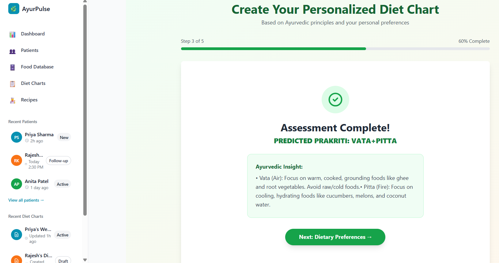
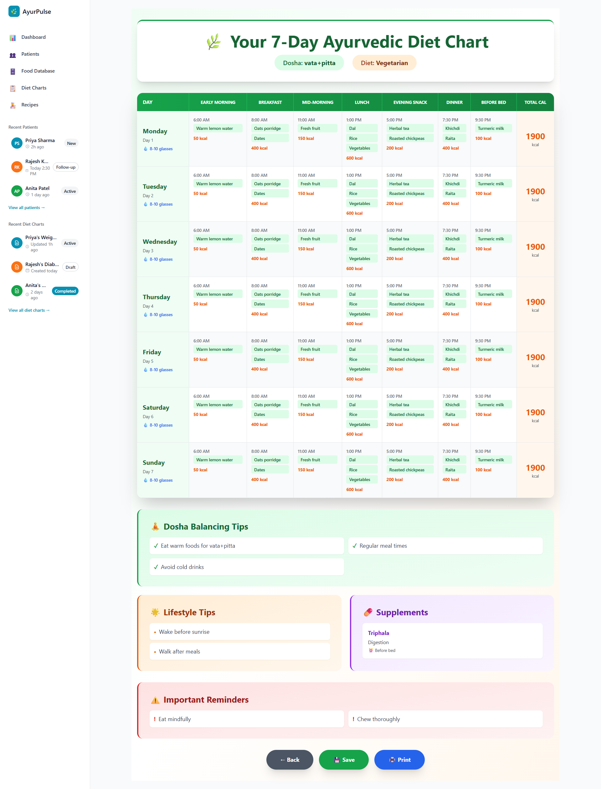
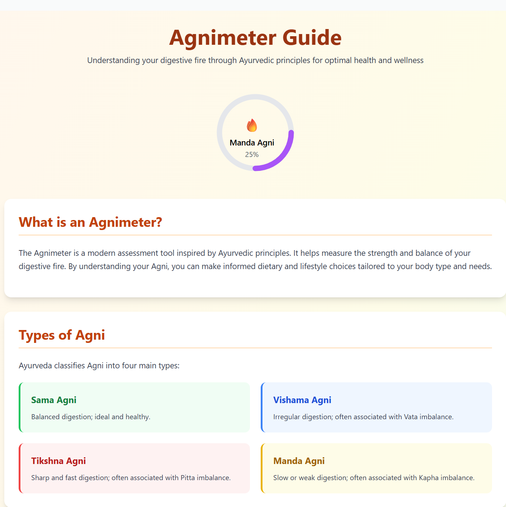

# 🌿 AyurPulse — Automated Ayurvedic Diet Chart Generator

<p align="center">
  
  
  
  
  
  
  
  
</p>

> AyurPulse bridges the ancient science of Ayurveda with modern machine learning to deliver personalized diet charts tailored to your unique body constitution (Dosha).

---

## 📖 Table of Contents

- [About the Project](#-about-the-project)
- [Features](#-features)
- [How It Works](#-how-it-works)
- [Tech Stack](#-tech-stack)
- [Project Structure](#-project-structure)
- [Getting Started](#-getting-started)
  - [Prerequisites](#prerequisites)
  - [Backend Setup](#backend-setup)
  - [Frontend Setup](#frontend-setup)
  - [Environment Variables](#environment-variables)
- [CI/CD Pipeline](#-cicd-pipeline)
- [Deployment](#-deployment)
- [Ayurvedic Concepts](#-ayurvedic-concepts)
- [Screenshots](#-screenshots)
- [Contributing](#-contributing)
- [License](#-license)

---

## 🌱 About the Project

AyurPulse is a full-stack wellness application that uses a **Random Forest machine learning model** to classify a user's **Dosha** (body constitution) based on physical and physiological characteristics. It then leverages the **Google Gemini Generative AI API** to produce a comprehensive, personalized Ayurvedic diet chart.

Rooted in the principles of Ayurveda, AyurPulse helps individuals understand their body's natural tendencies and empowers them to make informed dietary decisions — all through a clean, modern interface.

---

## ✨ Features

### 🔮 Dosha Predictor
- Input physical characteristics such as metabolism, appetite, hair quality, eye shape, complexion, and weight.
- A trained **Random Forest classifier** predicts your Dosha type:
  - **Vata** — Air & Space
  - **Pitta** — Fire & Water
  - **Kapha** — Earth & Water
  - **Combination Doshas** — e.g., Vata-Pitta, Pitta-Kapha, Vata-Kapha, Tridosha

### 🥗 AI-Generated Diet Chart
- After Dosha prediction, the user provides additional context:
  - Food restrictions and allergies
  - Budget preferences
  - Health goals (weight loss, energy boost, immunity, etc.)
  - Timeline
- A comprehensive prompt is constructed and sent to the **Gemini API**, which returns a detailed, Ayurveda-aligned diet chart.

### 🔥 Agnimeter
- A unique feature that visualizes the user's **Agni** (digestive fire / metabolic strength) levels throughout the day.
- Based on Ayurvedic time theory, it maps the optimal windows for meals to maximize energy usage and support digestion.
- Helps users understand *when* to eat, not just *what* to eat.

---

## ⚙️ How It Works

```
User Input (Physical Characteristics)
        │
        ▼
 Flask Backend API
        │
        ▼
Random Forest Model (pickle)
  → Dosha Classification
        │
        ▼
User Provides Additional Details
(allergies, budget, goals, timeline)
        │
        ▼
Prompt Engineering + Gemini API
  → Personalized Diet Chart
        │
        ▼
React Frontend Displays Results
     + Agnimeter
```

1. The user fills in a questionnaire about their physical traits on the React frontend.
2. The data is sent to the Flask backend, which loads the trained Random Forest model (serialized via **Pickle**) to predict the Dosha.
3. The predicted Dosha, along with user-provided dietary preferences, is combined into a structured prompt.
4. The prompt is sent to the **Google Gemini API**, which generates a personalized Ayurvedic diet chart.
5. Results — including the diet chart and the Agnimeter visualization — are rendered on the frontend.

---

## 🛠️ Tech Stack

| Layer | Technology |
|---|---|
| **Frontend** | React.js, Tailwind CSS |
| **Backend** | Python, Flask |
| **ML Model** | Random Forest (scikit-learn), Pandas, Pickle |
| **Generative AI** | Google Gemini API |
| **CI/CD** | GitHub Actions |
| **Frontend Deployment** | Vercel |
| **Backend Deployment** | Render |

---

## 📁 Project Structure

```
ayurpulse/
│
├── client/                        # React Frontend
│   ├── public/
│   ├── src/
│   │   ├── components/
│   │   │   ├── DoshaForm.jsx      # Physical characteristics input form
│   │   │   ├── DietChart.jsx      # AI-generated diet chart display
│   │   │   ├── Agnimeter.jsx      # Metabolic clock visualization
│   │   │   └── ResultCard.jsx     # Dosha result display
│   │   ├── pages/
│   │   │   ├── Home.jsx
│   │   │   ├── Predict.jsx
│   │   │   └── DietPlan.jsx
│   │   ├── App.jsx
│   │   └── main.jsx
│   ├── tailwind.config.js
│   └── package.json
│
├── server/                        # Flask Backend
│   ├── model/
│   │   ├── dosha_model.pkl        # Trained Random Forest model
│   │   └── train_model.py         # Model training script
│   ├── data/
│   │   └── dosha_dataset.csv      # Training dataset (Pandas)
│   ├── app.py                     # Flask application entry point
│   ├── routes/
│   │   ├── predict.py             # Dosha prediction endpoint
│   │   └── diet.py                # Diet chart generation endpoint
│   ├── utils/
│   │   └── prompt_builder.py      # Gemini prompt engineering
│   └── requirements.txt
│
├── .github/
│   └── workflows/
│       ├── ci.yml    # Deployment workflow
│
└── README.md
```

---

## 🚀 Getting Started

### Prerequisites

- **Node.js** v18+
- **Python** 3.9+
- **Google Gemini API Key** — [Get it here](https://aistudio.google.com/app/apikey)
- **pip** and **npm** installed

---

### Backend Setup

```bash
# Clone the repository
git clone https://github.com/prajakta2005/AyurPulse.git
cd ayurpulse/server

# Create a virtual environment
python -m venv venv
source venv/bin/activate       # On Windows: venv\Scripts\activate

# Install dependencies
pip install -r requirements.txt

# Train the model (if pkl not present)
python model/train_model.py

# Start the Flask server
python app.py
```

The backend will run at `http://localhost:5000`.

---

### Frontend Setup

```bash
# Navigate to the client directory
cd ../client

# Install dependencies
npm install

# Start the development server
npm run dev
```

The frontend will run at `http://localhost:5173`.

---

### Environment Variables

Create a `.env` file in the `server/` directory:

```env
GEMINI_API_KEY=your_google_gemini_api_key
FLASK_ENV=development
FLASK_DEBUG=1
```

Create a `.env` file in the `client/` directory:

```env
VITE_API_BASE_URL=http://localhost:5000
```

---

## 🔄 CI/CD Pipeline

AyurPulse uses **GitHub Actions** for continuous integration and deployment.

### Workflows

| Workflow | Trigger | Action |
|---|---|---|
| `ci.yml` | Push to `main` | Automatically runs a CI process using GitHub Actions. It checks out the repository, installs Node.js dependencies, builds the frontend, sets up Python 3.11, installs backend dependencies from requirements.txt, and verifies backend code by compiling app.py to detect syntax errors. |

### Secrets Required (GitHub Repository Settings)

| Secret | Description |
|---|---|
| `VERCEL_TOKEN` | Vercel authentication token |
| `VERCEL_ORG_ID` | Your Vercel organization ID |
| `VERCEL_PROJECT_ID` | Your Vercel project ID |
| `RENDER_DEPLOY_HOOK_URL` | Render deploy hook for backend |
| `GEMINI_API_KEY` | Google Gemini API key |

---

## 🌐 Deployment

| Service | Platform | URL |
|---|---|---|
| Frontend | Vercel | [https://ayurpulse.vercel.app](https://ayurpulse.vercel.app) |
| Backend API | Render | [https://ayurpulse-backend.onrender.com/](https://ayurpulse-backend.onrender.com/) |

---

## 🪔 Ayurvedic Concepts

### The Three Doshas

| Dosha | Elements | Traits |
|---|---|---|
| **Vata** | Air + Space | Light, dry, mobile, creative, quick-thinking |
| **Pitta** | Fire + Water | Sharp, intense, focused, warm, ambitious |
| **Kapha** | Earth + Water | Stable, heavy, calm, nurturing, methodical |

### Agni (Digestive Fire)
In Ayurveda, **Agni** represents the metabolic and digestive strength of the body. It fluctuates throughout the day following natural rhythms — strongest around midday and weakest at night. AyurPulse's **Agnimeter** feature visualizes this curve to guide users on the best times to consume their meals for optimal digestion and energy.

---

## 📸 Screenshots

### Dosha Prediction Page



### Diet Chart Page



### Agnimeter Page



---

## 🤝 Contributing

Contributions are welcome! Please follow these steps:

1. Fork the repository.
2. Create a new branch: `git checkout -b feature/your-feature-name`
3. Commit your changes: `git commit -m 'Add some feature'`
4. Push to the branch: `git push origin feature/your-feature-name`
5. Open a Pull Request.

Please make sure your code follows the existing style and all tests pass before submitting.

---

## 📄 License

This project is licensed under the [MIT License](LICENSE).

---

<p align="center">
  Made with 🌿 and ancient wisdom · AyurPulse
</p>